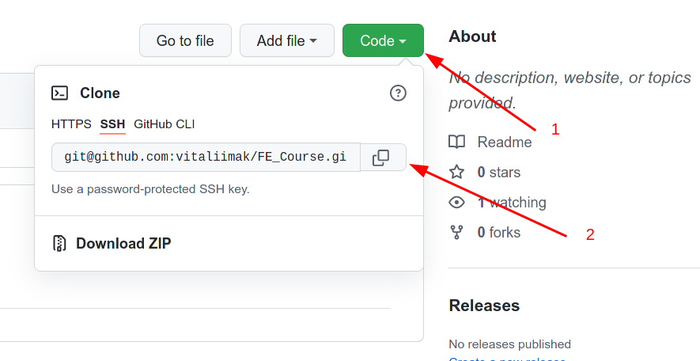
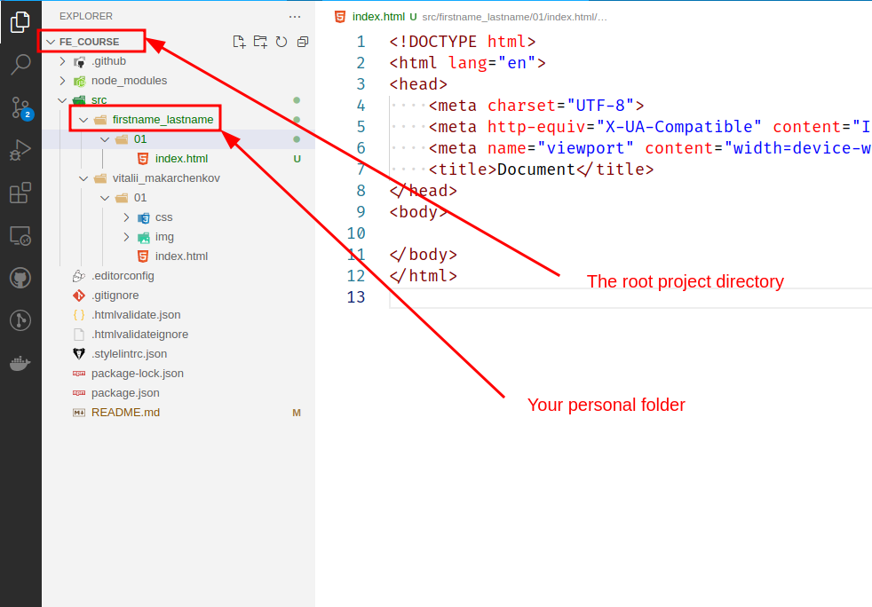

# FE_Course

## Table of contents

* [Initial Setup](#initial-setup)
* [NPM Setup](#npm-setup)

### Initial setup

1. Copy SSH link of the repository

2. Clone repository on your local computer
```
git clone LINK_FROM_SECOND_STEP
```
3. Create your personal folder inside the `src` folder with structure:
```
src/
└── vitalii_makarchenkov/
    └── 01/
        └── index.html
```
4. Open VSCode in FE_Course folder. Should look like that:


### NPM Setup

1. Install [NodeJS](https://nodejs.org/en/) (LTS version)
2. Open terminal in the root project folder (FE_Course)
3. Run command `npm install`

### Run Linters Locally

1. Open terminal in the root project folder (FE_Course)
2. Run **stylelint** command `npm run stylelint`
3. Run automatic **stylelint** errors fix command `npm run stylelint:fix` (be carful to not fix alien code)
3. Run **htmllint** command `npm run htmllint`
