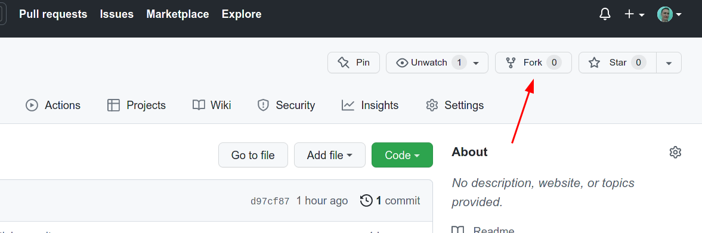

# FE_Course

1. Fork the main repository

2. Copy SSH link to your forked repository

3. Clone your forked repository on your local computer
```
git clone LINK_FROM_SECOND_STEP
```
4. Create your personal folder inside the `src` folder with structure:
```
src/
└── vitalii_makarchenkov/
    └── 01/
        └── index.html
```
5. Copy `.editorconfig` and `.gitignore` files inside your personal folder
6. Open VSCode in your personal folder. Should look like that:

